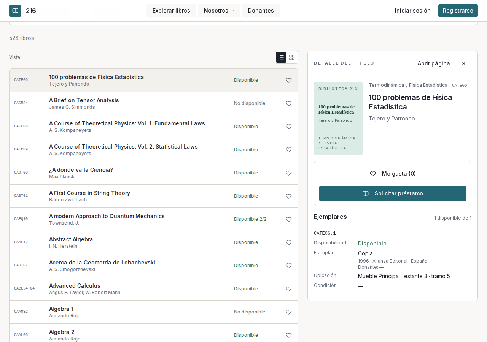

# Interface design

The public interface uses a short, consistent scale:

- Type: `0.7rem` for labels, `0.875rem` for metadata, `1rem` for controls,
  `1.875rem` for page headings, and `2.25rem` for a work title.
- Spacing: multiples of `0.25rem`; surfaces use `0.75rem` padding in lists and
  between `1.5rem` and `2.5rem` in detail views.
- Color: the home, catalogue, book page, header, footer, authentication and
  profile pages, admin pages and
  [`BookCover`](../src/components/catalogue/book-cover.tsx) use only tokens from
  [`globals.css`](../src/app/globals.css), with light and dark values.
  [`src/app/about`](../src/app/about) and
  [`src/components/ui`](../src/components/ui) still use their own colors.
  Semantic status colors use the named `status-*` tokens in the same file.

Admin pages use the same type scale, spacing, surfaces, borders and buttons. The
loans desk keeps the queue dense on wide screens and stacks each row below 768
pixels. Intake shows a generated cover beside the fields, because a new title
has no stored cover, with one primary action and an inline error under each
invalid field.

## Components

[`BookCover`](../src/components/catalogue/book-cover.tsx) keeps a fixed 2:3
ratio. A stored image uses `/media/`; when absent, the component renders a
typographic cover with title, author, category, and a deterministic color
derived from the category. A grid therefore does not depend on a complete image
collection. The typographic cover sizes its text and padding from its own width,
so the same component fits a grid card, the book page, and the narrow detail
pane.

The cover uses `loading="lazy"` below the first visible section and fixed
dimensions. The catalogue offers a dense list and a grid. At 1024 pixels and
wider, list view splits into the list and a sticky detail pane of fixed width
(`24rem`, `28rem` from 1280 pixels); the list takes the rest. Selecting a title
keeps the list's filters and scroll position. The selected title is in the
`book` URL parameter, so a reload or shared link opens the same pane. Grid view
has no pane; its cards link to the book page. Below 1024 pixels, selecting a
title opens its page. The list keeps the `/`, arrow, Enter, and Escape
shortcuts; search updates results without losing focus. Category and
availability filters remain visible.

The pane renders the book page's own components:
[`BookClient`](../src/app/books/[id]/book-client.tsx) with `variant="pane"`, a
compact `BookHeader`, and `CopiesTable` with `layout="stacked"`, which lists
each copy as label and value rows instead of table columns.

A book page places the cover and borrow action beside the title, author, code,
category, and copy table. Availability remains owned by the shared
`copyIsLendable` query in
[`src/features/books/sql.ts`](../src/features/books/sql.ts).

## Imported covers

`bun run covers:fetch` queries Open Library one work at a time. It normalizes
the title and first author, requires a close title match, stores the response in
`.cache/covers/open-library.json`, and records misses in
`.cache/covers/misses.json`. It downloads accepted images to the existing
`book-images/` R2 prefix, records `/media/book-images/...` in `books` and
`book_images`, and never stores an Open Library URL.

By default the database and bucket are Wrangler's local bindings and the command
needs no credentials. `--remote` targets production; see
[deployment](deployment.md#load-the-covers). `--dry-run` matches, prints each
cover it would store, and writes nothing: not to R2, the database or the cache
files. It reads the cache files if they exist. After the first remote upload the
script lists the key it wrote and fails the upload if R2 does not show it.

## Review screenshots

`bun run screenshots` opens a running site, `http://localhost:3000` unless
`SCREENSHOT_BASE_URL` says otherwise, and writes the home page, the catalogue
grid, the 1280-pixel split catalogue, and a book with a stored cover and one
without to `docs/ui/` at 375 and 1280 pixels. It looks for those two books
through every catalogue page and only reads the site. When no book has a stored
cover, or none lacks one, it prints a warning and skips that book's captures.
`bun run screenshots -- --dark` writes the same files with a `-dark` suffix. The
command requires Chromium, installed with `bunx playwright install chromium`.
